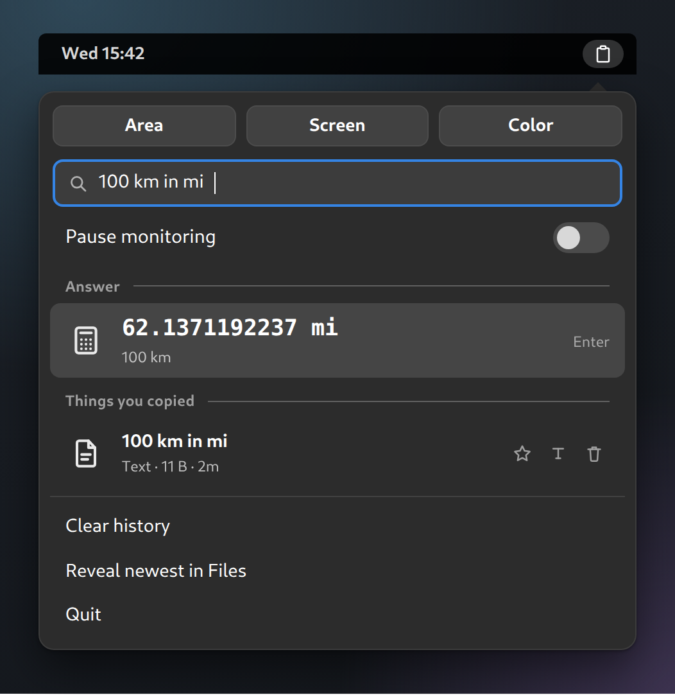
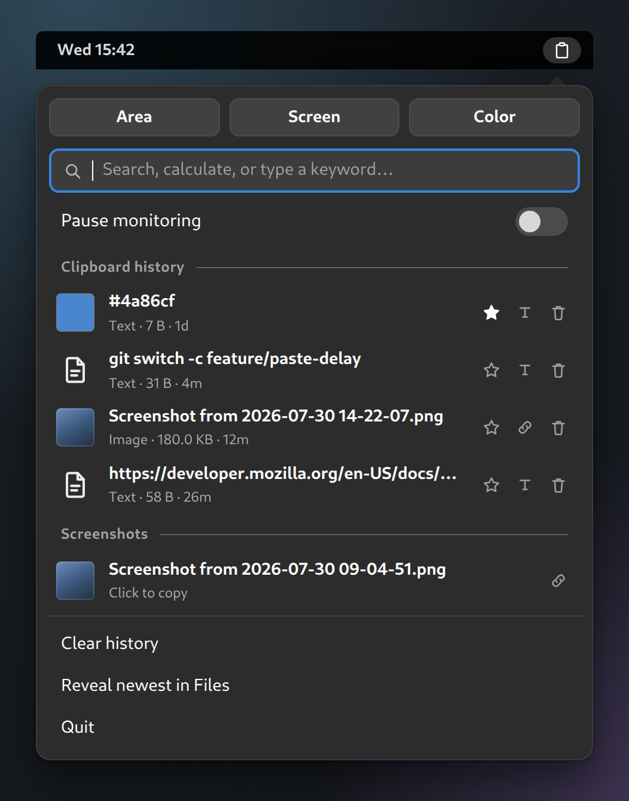
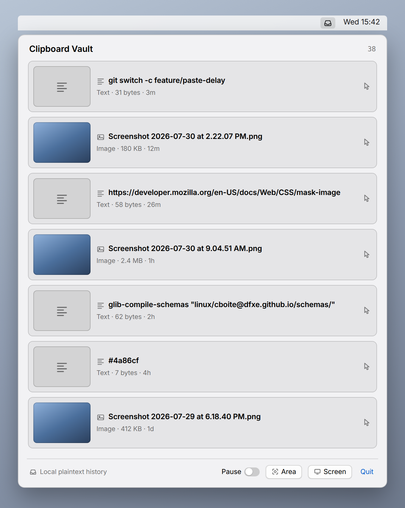

# 📋 cBoite

**Everything you copy, within reach.** A top-bar vault for your clipboard
history and recent screenshots — on macOS *and* GNOME.


[](https://dfxe.github.io/cboite)

Your system clipboard remembers exactly one thing. cBoite keeps the last
few hundred, puts your recent screenshots next to them, and hands any of it back
with a click. On GNOME it also does the handful of things people actually open
Raycast for — snippets, a calculator, quicklinks, an emoji picker — from the
same search box.

No accounts and no sync. Nothing leaves your disk unless you switch on currency
conversion, which is off by default and is the only feature that touches the
network.

```
macos/    Swift + SwiftUI MenuBarExtra app   (macOS 13+, no Xcode project)
linux/    GNOME Shell extension, GJS / ESM   (GNOME 45–49, no build step)
```

## 📸 What it looks like

| GNOME — the command bar | GNOME — history and screenshots |
| ----------------------- | ------------------------------- |
|  |  |



> **Rendered mockups with sample data, not live captures.** Layout, strings and
> number formatting come from the source; the contents are invented. Built from
> `docs/mocks/` by `docs/build.mjs` — see [The website](#the-website).

## ✨ At a glance

The two platforms share a design, not a codebase. GNOME is the more complete
implementation today.

|                                        | macOS | GNOME |
| -------------------------------------- | :---: | :---: |
| Clipboard history (text + images)      |   ✅   |   ✅   |
| Screenshot capture (area / screen)     |   ✅   |   ✅   |
| Screen color picker (hex)              |   —   |   ✅   |
| Search · pin · delete                  |   —   |   ✅   |
| Pause (incognito)                      |   ✅   |   ✅   |
| Ranked command bar + keyboard nav      |   —   |   ✅   |
| Snippets with placeholders             |   —   |   ✅   |
| Calculator · units · dates             |   —   |   ✅   |
| Quicklinks + web search                |   —   |   ✅   |
| Emoji & symbol picker                  |   —   |   ✅   |
| Currency conversion (opt-in, network)  |   —   |   ✅   |
| Auto-expiry, size caps, settings UI    |   —   |   ✅   |
| Configurable shortcuts                 |   —   |   ✅   |
| Password-manager filtering             |   ✅   |   ✅   |
| Paste injection                        |   ✅   |   ✅   |
| Clipboard auto-clear                   |   ✅   |   —   |
| Encrypted at rest                      |   —   |   —   |

## ⚡ Quick start

**macOS** — needs the Xcode command-line tools (`xcode-select --install`). No
third-party dependencies.

```sh
cd macos
./build.sh
open build/cBoite.app
```

**GNOME** — no build step, but the bundled GSettings schema must be compiled once
(and again whenever it changes).

```sh
glib-compile-schemas "linux/cboite@dfxe.github.io/schemas/"
mkdir -p ~/.local/share/gnome-shell/extensions
ln -s "$PWD/linux/cboite@dfxe.github.io" ~/.local/share/gnome-shell/extensions/
# X11: Alt+F2 → r → Enter.   Wayland: log out and back in.
gnome-extensions enable cboite@dfxe.github.io
```

## 🍎 macOS

A vault icon appears in the menu bar; no Dock icon (`LSUIElement`). Copy as usual
and it lands in the popover; click a row to select it for the next paste.

| Shortcut                | Does                                                      |
| ----------------------- | --------------------------------------------------------- |
| `⌘V`                    | Pastes the selected vault item (newest, if none selected)  |
| `⌃⌥S`                   | Capture an area into the vault                             |
| `⇧⌘3` / `⇧⌘4` / `⇧⌘5`   | Capture — **replaces** the native macOS screenshot UI      |

None of these are configurable.

> ⚠️ **The native screenshot shortcuts are swallowed, not shared.** While
> cBoite runs, `⇧⌘3`/`⇧⌘4`/`⇧⌘5` never reach macOS, including the `⇧⌘5`
> toolbar. Quit to get them back.

`⌘V` is intercepted globally: the app swallows the keystroke, puts the selected
item on the pasteboard just in time, synthesizes a paste, then wipes it ~350 ms
later — so the pasteboard sits empty and every paste routes through the vault.
Needs **Accessibility** permission; without it `⌘V` behaves normally. Screenshots
go into the app's own storage, and it never scans `$HOME`.

### Current limits

The popover has a Pause toggle, Area, Screen and Quit, and nothing else.

- No per-item delete, no clear-history, no pin, no search.
- History capped at 200 entries, oldest dropped. Not configurable.
- Images are base64-inline in `vault.json` with no size cap, so a history of
  Retina screenshots gets very large.
- To wipe: quit, then
  `rm ~/Library/Application\ Support/cboite/vault.json`.

## 🐧 GNOME

A clipboard icon appears in the top panel. Copy text or an image and it shows up
under **Clipboard history**; `PrtScn` shots show under **Screenshots**.

### The command bar

The box at the top searches everything at once and ranks the results, each source
under its own heading, focused the moment the popup opens.

| Key | Does |
| --- | --- |
| `↑` `↓` | Move through results, across section boundaries |
| `Page Up` / `Page Down` | Jump eight rows |
| `Enter` | Activate the selected row |
| `Esc` | Clears the query, then leaves a tool, then closes the popup |

Sections are ordered **Answer**, **Quicklinks**, **Snippets**, **Emoji &
symbols**, **Clipboard history**, **Screenshots** — each capped, and hidden when
nothing matches. Ranking is shared by every source: exact beats prefix beats word
boundary beats substring beats loose subsequence (`bgcol` finds
`background-color`), and shorter matches win ties.

Activating a row copies it **and** sends `Ctrl+V` to the window that had focus
(`Ctrl+Shift+V` in terminals). If a paste lands somewhere unexpected, raise
**Paste delay**.

### Tools

- **Answer** — arithmetic (`2+2*8`), units (`100 km in mi`), percentages
  (`20% of 300`) and dates (`today + 30 days`), all kept in history. The parser
  is hand-written with no `eval()`: this runs inside the compositor process.
- **Snippets** — searched by keyword, label or body, with `{date}`, `{time}`,
  `{clipboard}`, `{uuid}` and `{cursor}` placeholders (`{date:%d %b %Y}` takes
  any `strftime` format). Every text row has a **Save as snippet** button.
- **Quicklinks** — `gh cboite` opens a GitHub search; typing `github`
  finds it by name. Nine are set up on first run and stay deleted if you delete
  them; a **Search the web for…** row catches the rest.
- **Emoji & symbols** — recently-used first, plus arrows, maths, Greek, currency
  and the invisible characters. No data is bundled: it reads the set GNOME Shell
  already ships.
- **Currency** — `100 usd in eur`, **off by default**. See
  [Currency and the network](#currency-and-the-network).

### The rest

- **History** — text and PNGs, deduplicated, newest first (200 by default). Every
  row has **pin** (exempt from the cap and from expiry) and **delete**.
- **Pause** — incognito toggle. Password-manager-flagged content is skipped
  either way.
- **Screenshots** — the 10 newest PNGs in `~/Pictures/Screenshots`.
- **Capture** — **Area** and **Screen** via GNOME's own screenshot service.
- **Color** — an eyedropper with a live `#RRGGBB` readout. Hex entries show in
  the list as a colour swatch.
- **Quit** — turns the extension off from the popup; it stays off across a reboot.

Clicking an image row puts real PNG bytes on the clipboard, which GUI apps paste
directly. Terminals shell out to a helper, so `Ctrl+V` there needs `xclip` (X11)
or `wl-clipboard` (Wayland). Every image row also has a **link** button that
copies the *path* instead — no helper needed, and it works over SSH.

### Upgrading from clipboard-box

The project was called `clipboard-box` until it wasn't, and the rename moved both
the extension UUID and the data directory. History, images and cached rates
migrate themselves the first time the new build runs. Snippets and quicklinks
live in dconf under the old schema path, so they need one line — run it **before**
removing the old extension:

```sh
dconf dump /org/gnome/shell/extensions/clipboard-box/ \
  | dconf load /org/gnome/shell/extensions/cboite/
gnome-extensions disable clipboard-box@dfxe.github.io
rm ~/.local/share/gnome-shell/extensions/clipboard-box@dfxe.github.io
```

### Preferences

```sh
gnome-extensions prefs cboite@dfxe.github.io
```

Four pages: **General**, **Tools**, **Snippets** and **Quicklinks**. Edits reach
the popup immediately, without a shell restart.

| Setting                     | Default                  | Effect                                             |
| --------------------------- | ------------------------ | -------------------------------------------------- |
| Maximum entries             | 200                      | Oldest unpinned dropped first                       |
| Auto-expire after (days)    | 0 — never                | Unpinned entries only                               |
| Store copied images         | on                       | Off = text only; Area/Screen captures still stored  |
| Max copied-image size       | 10 MB                    | 0 = unlimited; captures are exempt                  |
| Screenshots folder          | `~/Pictures/Screenshots` | Watched *and* captured into                         |
| Pause monitoring            | off                      | Incognito                                           |
| Encrypt history at rest     | off                      | **Not implemented** — inert placeholder             |
| Paste after copying         | **on**                   | Sends `Ctrl+V` to the focused window                |
| Use Ctrl+Shift+V in terminals | on                     | Matched on window class                             |
| Paste delay                 | 120 ms                   | Raise if pastes land in the wrong place             |
| Fallback search URL         | DuckDuckGo               | Used by the "Search the web for…" result            |
| Convert currencies          | **off**                  | The only setting that enables a network request     |
| Exchange rate endpoint      | frankfurter.app          | ECB daily rates, no API key                         |

Shortcuts are all unbound by default and take a raw accelerator string such as
`<Super><Shift>V`: **Open clipboard menu**, **Capture area**, **Capture
screen**, **Pick color**, **Open snippets**, **Open emoji picker**. The last two
open the popup scoped to that one tool.

### Currency and the network

The only feature that makes a network request, and **off by default** — with it
off nothing is ever fetched. With it on, rates come from `api.frankfurter.app`
(ECB daily reference rates, no API key, configurable endpoint), fetched only when
you type a conversion and at most once every 12 hours, then cached to
`~/.local/share/cboite/rates.json` so offline you get the cached rates
with their age shown. Only the currency codes are implied by the request.

## 🔒 Storage & privacy

Everything is local. The opt-in exchange-rate fetch is the only outbound request.

|                     | macOS                                                       | GNOME                                        |
| ------------------- | ----------------------------------------------------------- | -------------------------------------------- |
| History             | `~/Library/Application Support/cboite/vault.json`     | `~/.local/share/cboite/vault.json`     |
| Images              | inline, base64 in `vault.json`                               | `~/.local/share/cboite/images/*.png`   |
| Screenshots         | `~/Library/Application Support/cboite/synced-screenshots/` | `~/Pictures/Screenshots/`               |
| Snippets, quicklinks | —                                                          | GSettings (`dconf`), as JSON strings          |
| Cached rates        | —                                                            | `~/.local/share/cboite/rates.json`     |
| File perms          | `0600`                                                       | `0600` / `0700`                               |

Snippets live in GSettings so an edit in the preferences window — a separate
process — reaches the popup straight away, but `dconf` is **not** `0600`-protected
the way `vault.json` is.

**Neither platform encrypts at rest.** `VaultCrypto.swift` holds a complete
scheme (Curve25519 ECDH → HKDF-SHA256 → AES-GCM, keys in the Keychain) but
**nothing calls it yet**, and GNOME's **Encrypt history at rest** toggle is
likewise inert. Don't copy secrets you wouldn't want written to disk. Both
platforms skip content a password manager has flagged
(`org.nspasteboard.ConcealedType` and friends on macOS, `passwordmanagerhint` and
friends on GNOME), but an app that sets none of them is indistinguishable from
any other — and macOS also stores unrecognised pasteboard flavors, so it captures
more than GNOME.

**An unreadable history file is moved aside, never overwritten** — renamed to
`vault.corrupt-<timestamp>.json`, and the app starts empty.

## 🛠 Development

```sh
linux/tests/run.sh          # unit tests
linux/tests/parse-check.sh  # syntax-check every module
```

No dependencies and no build step: the tested modules import nothing from
`resource:///`, so they load in plain `gjs` with no Shell and no display. That
covers `match`, `calc`, `units`, `format`, `configStore`, `searchRegistry` and
`vaultStore`; everything else imports `St`/`Clutter` and needs a real shell, so
`parse-check.sh` at least syntax-checks those.

Four invariants that are easy to break by accident:

- **Every clipboard write goes through `clipboardUtil.ingestText()`** — vault
  first so it owns the fingerprint, tell the monitor to ignore it, *then* write.
  Wrong order and our own writes return as new history entries.
- **The monitor's ignore set is consuming.** `.has()` instead of `.delete()`
  silently drops a later manual copy of the same text.
- **Nothing runs on the compositor thread that doesn't have to** — providers
  score pre-normalized text, and vault writes are coalesced and async, which is
  why `disable()` must call `vault.flush()`.
- **Rebuilds are suspended while a row is activating**, or the rebuild destroys
  the row that is about to show its ✓.

Adding a tool means writing a `{id, title, cap, search(query, ctx)}` provider and
appending it to `PROVIDERS`; providers are pure, synchronous and never touch
`St`. Extension JS changes need a **full gnome-shell restart**, not
disable/enable — X11 `Alt+F2` → `r`, Wayland log out or
`dbus-run-session -- gnome-shell --nested --wayland`. Changes under `schemas/`
need `glib-compile-schemas schemas/` first, or `enable()` throws. Anything
holding a resource must be cleared at the top of **both** `enable()` and
`disable()`, or a modal grab outlives the extension and the session stops
responding to clicks.

### The website

[dfxe.github.io/cboite](https://dfxe.github.io/cboite) is built
from this file: `docs/build.mjs` lifts the tagline, lede, support matrix and
quick start into `docs/index.template.html`, so the page has no prose of its own
to fall out of date. A push to `main` redeploys it.

```sh
npm ci --prefix docs
npx --prefix docs playwright install chromium
node docs/build.mjs      # renders docs/shots/*.png, then docs/_site/
```

`docs/_site/` is the published output and is gitignored; `docs/shots/` is not,
because the screenshots above point at it. CI runs `node docs/build.mjs --check`,
which hashes `docs/mocks/` against `docs/shots/manifest.json` — **edit a mock,
rebuild, commit the PNGs** or the README keeps showing the old UI.

## License

MIT — see [LICENSE](LICENSE).
